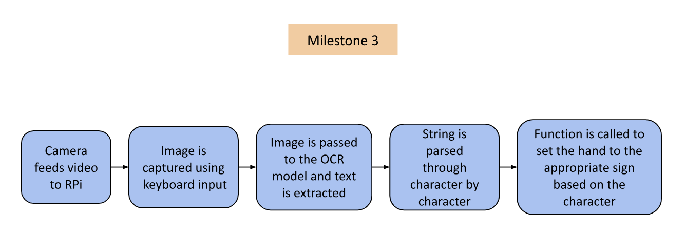

# ASL Robotic Arm
<!--Replace this text with a brief description (2-3 sentences) of your project. This description should draw the reader in and make them interested in what you've built. You can include what the biggest challenges, takeaways, and triumphs from completing the project were. As you complete your portfolio, remember your audience is less familiar than you are with all that your project entails!-->

The ASL Robotic Arm uses image detection to recognize certain letters and displays the ASL representation of that letter. It uses a robotic hand which uses 5 servos to control the movement of each finger.

<!---You should comment out all portions of your portfolio that you have not completed yet, as well as any instructions: -->

| **Engineer** | **School** | **Area of Interest** | **Grade** |
|:--:|:--:|:--:|:--:|
| Anusha B. | Monta Vista High School | Mechanical Engineering | Incoming Junior

<!---**Replace the BlueStamp logo below with an image of yourself and your completed project. Follow the guide [here](https://tomcam.github.io/least-github-pages/adding-images-github-pages-site.html) if you need help.** -->


# Demo Night

<iframe width="560" height="315" src="https://www.youtube.com/embed/leiJ5s-gqag?si=oH25e3IacjwMTYMn" title="YouTube video player" frameborder="0" allow="accelerometer; autoplay; clipboard-write; encrypted-media; gyroscope; picture-in-picture; web-share" referrerpolicy="strict-origin-when-cross-origin" allowfullscreen></iframe>

# Final Milestone

<!--**Don't forget to replace the text below with the embedding for your milestone video. Go to Youtube, click Share -> Embed, and copy and paste the code to replace what's below.**-->

<iframe width="560" height="315" src="https://www.youtube.com/embed/O7hauhR8GNw?si=lLpQNig1z2B_52fj" title="YouTube video player" frameborder="0" allow="accelerometer; autoplay; clipboard-write; encrypted-media; gyroscope; picture-in-picture; web-share" referrerpolicy="strict-origin-when-cross-origin" allowfullscreen></iframe>

For my final milestone, I combined my machine learning optical character recognition with my robot hand control for my final ASL Robot! The camera captures an image from the live video feed when any key on the keyboard is pressed. Then, that image is stored and the OCR model makes a prediction using the image. In my code, the detected text is gone through character-by-character, and the corresponding method is called to set the hand in the formation of the letter. 

While working on this milestone, I faced many challenges. After the second milestone, I wanted to create a faster video feed, especially because it slowed down after combining it with the hand’s code. I needed to use the Picamera2 library, which is the most compatible with my Raspberry Pi. I later found out that because I installed so many libraries to the base environment, the Picamera2 library was not able to function properly, so when I started over with a new SD card and a new Pi, I was very careful about creating virtual environments and installing libraries.

## Flowchart

*Figure 1*

Figure 1 shows the new flow of the software of my project. Instead of reading from a live feed, an image is captured through keyboard input. This image is read by the OCR model. By using this process instead of the old one, the video feed and text recognition are much faster.

## OCR Model


*Figure 2: Above is an image of the CRAFT model from Researchgate which is used to look for text in an image. See code example: https://github.com/clovaai/CRAFT-pytorch*


*Figure 3: Above is an image of the CRNN model from The AI Learner which is used to identify text characters. See code example: https://github.com/janzd/CRNN*

The specific ML model I used was Keras OCR, source code here: https://github.com/faustomorales/keras-ocr?tab=readme-ov-file. There are two stages in the text recognition process: looking for text in the image and identifying the text. Keras OCR is dependent on the CRAFT model, shown in Figure 2, to look for text characters in an image and the CRNN model, shown in Figure 3, to identify what each character is. 

## Important Methods


*Figure 4: Above is an image from the Keras OCR API showing the recognize() method. This method exists in a Pipeline object from Keras OCR*

Figure 4 displays the recognize() method from the keras-ocr API. This method is what performs the text recognition. To optimize for efficient text recognition,  the text needs to take up as much of the frame as possible, and the image needs to be scaled to a smaller size for speed. To ensure this, I held up the paper with text very close to the camera, and resized the captured image to 20% of its original size in my code before passing it to the recognize() method. I tried to scale the image to 10% and 15% to make it faster, but that resulted in the accuracy of the text-recognition being compromised.


*Figure 5: Above is an image from the Picaera2 library documentation showing the capture_array method*

Figure 5 displays the documentation and an example of the capture_array() method. This is the function from the Picamera2 library that is responsible for taking a picture from the live video feed. As shown above, the array returned by the method can be stored as a variable. By storing the array as a variable, I am able to place it in an array of images and extract it when I resize it.

## Case CAD

*Figure 6: Above is an image of the CAD for the case I made for my project.*

# Second Milestone

<iframe width="560" height="315" src="https://www.youtube.com/embed/jk74IgKE5pA?si=5Ikt3A3PYuS-8cEA" title="YouTube video player" frameborder="0" allow="accelerometer; autoplay; clipboard-write; encrypted-media; gyroscope; picture-in-picture; web-share" referrerpolicy="strict-origin-when-cross-origin" allowfullscreen></iframe>

For my second milestone, I configured my Raspberry Pi to recognize letters. I used EasyOCR, a Python OCR module. OCR stands for Optical Character Recognition, which refers to identifying letters, numbers, special characters, as well as full words. I initially tried using OpenCV to perform text recognition, but I was running into many errors when trying to turn on my camera with the necessary Picamera library. The difference between OpenCV and EasyOCR is that OpenCV is a library that is used for computer vision and object detection, whereas EasyOCR is used specifically for extracting text from an image. After I made the switch to EasyOCR, it started working immediately.

Here is the snippet of code displaying how EasyOCR is used in the code:
```python
import easyocr
# Initialize the EasyOCR reader with English language support
reader = easyocr.Reader(['en'])
# Start the camera stream
capture_manager.start()
while not capture_manager.stopped:
    if capture_manager.frame is None:
        continue
    frame = capture_manager.read() 
    # Perform OCR on the frame using EasyOCR
    result = reader.readtext(np.array(frame), detail=1)  
    # Process and log the results
    prediction = [(bbox, text, conf) for bbox, text, conf in result]
    logging.info(prediction)
    
    # Additional processing based on the OCR results
    for p in prediction:
        label, name, conf = p
        if conf > CONFIDENCE_THRESHOLD:
            # Handle detected text
            print("Detected", name)
```

The video feed displaying the camera’s input is currently very slow at about 0.3 frames per second (FPS). The  text recognition process is computationally expensive, taking  a heavy toll on the Raspberry Pi. The computation makes  it difficult to simultaneously process the frames from the camera and  display video at a high framerate. I made many attempts to speed up the video feed. I tried to set the framerate in code, reduce the load on the Pi by processing every 10 frames instead of checking every single frame, and also trigger the text recognition process using keyboard input. However, none of these attempts sped up the video display. I hope to find potential solutions for this later.

Now I will focus on completing my third milestone: making my robotic hand responsive to  video input by signing the letter detected by the Pi. Specifically I will build upon my first milestone , by writing  a new file with code that handles text recognition as well as the servo positions for the hand.


<!-- For your second milestone, explain what you've worked on since your previous milestone. You can highlight:
- Technical details of what you've accomplished and how they contribute to the final goal
- What has been surprising about the project so far
- Previous challenges you faced that you overcame
- What needs to be completed before your final milestone -->

## Flowchart

*Figure 1*

Figure 1 visualizes a representation of how the software  of my project works. As part of my second milestone, I established an input/output system. The input is the camera’s video feed which the Raspberry Pi processes frame-by-frame using EasyOCR. The output is a simple print statement displaying, “Cam detected,” when the Pi detected the word “Cam” in the video frame. For the final product, the output would be the robotic hand signing a letter.

In my first milestone, I programmed the robotic hand to form 4 letters, but there was no input that it needed to respond to. For my next milestone, I am going to get the hand to form letters in response to the Pi detecting them, and I am going to write more functions so that the hand can form as many letters as possible.

## Examples
<!--[SERVO](Files/SERVO.png)   -->
  

## EasyOCR Framework


EasyOCR utilizes ResNet, a neural network architecture used for computer vision that uses multiple layers to reduce error rates. Due to these multiple layers, the vanishing gradient problem arises, which occurs when the input signal is lost as it travels through the functions at each layer. To combat this, ResNet connects the layers using skip connections. The input is passed through each layer with residual output, but without the input to the previous layer.

## Code
```python
# SPDX-FileCopyrightText: 2021 Limor Fried/ladyada for Adafruit Industries
# SPDX-FileCopyrightText: 2021 Melissa LeBlanc-Williams for Adafruit Industries
#
# SPDX-License-Identifier: MIT

import time
import logging
import argparse
import pygame
import os
import subprocess
import sys
import numpy as np
import signal
import rpi_vision
import easyocr # importing easy ocr

CONFIDENCE_THRESHOLD = 0.5   # at what confidence level do we say we detected a thing
PERSISTANCE_THRESHOLD = 0.25  # what percentage of the time we have to have seen a thing

def dont_quit(signal, frame):
   print('Caught signal: {}'.format(signal))
signal.signal(signal.SIGHUP, dont_quit)

# App
from rpi_vision.agent.capturev2 import PiCameraStream

logging.basicConfig()
logging.getLogger().setLevel(logging.INFO)

# initialize the display
pygame.init()
# screen = pygame.display.set_mode((0,0), pygame.FULLSCREEN)
screen_width = 800
screen_height = 600
screen = pygame.display.set_mode((screen_width, screen_height))

capture_manager = None

FPS = 60

def parse_args():
    parser = argparse.ArgumentParser()
    parser.add_argument('--include-top', type=bool,
                        dest='include_top', default=True,
                        help='Include fully-connected layer at the top of the network.')

    parser.add_argument('--tflite',
                        dest='tflite', action='store_true', default=False,
                        help='Convert base model to TFLite FlatBuffer, then load model into TFLite Python Interpreter')

    parser.add_argument('--rotation', type=int, choices=[0, 90, 180, 270],
                        dest='rotation', action='store', default=0,
                        help='Rotate everything on the display by this amount')
    args = parser.parse_args()
    return args

last_seen = [None] * 10
last_spoken = None

def main(args):
    global last_spoken, capture_manager

    capture_manager = PiCameraStream(preview=False)
    
    capture_manager.camera.framerate=60
    
    capture_manager.camera.resolution=(320,240)

    if args.rotation in (0, 180):
        buffer = pygame.Surface((screen.get_width(), screen.get_height()))
    else:
        buffer = pygame.Surface((screen.get_height(), screen.get_width()))

    pygame.mouse.set_visible(False)
    screen.fill((0,0,0))
    try:
        splash = pygame.image.load(os.path.dirname(sys.argv[0])+'/bchatsplash.bmp')
        splash = pygame.transform.rotate(splash, args.rotation)
        # Scale the square image up to the smaller of the width or height
        splash = pygame.transform.scale(splash, (min(screen.get_width(), screen.get_height()), min(screen.get_width(), screen.get_height())))
        # Center the image
        screen.blit(splash, ((screen.get_width() - splash.get_width()) // 2, (screen.get_height() - splash.get_height()) // 2))

    except pygame.error:
        pass
    pygame.display.update()

    # Let's figure out the scale size first for non-square images
    scale = max(buffer.get_height() // capture_manager.resolution[1], 1)
    scaled_resolution = tuple([x * scale for x in capture_manager.resolution])

    # use the default font, but scale it
    smallfont = pygame.font.Font(None, 24 * scale)
    medfont = pygame.font.Font(None, 36 * scale)
    bigfont = pygame.font.Font(None, 48 * scale)

    #model = MobileNetV2Base(include_top=args.include_top)
    reader = easyocr.Reader(['en'])
    capture_manager.start()
    
    # frame_count = 0
    while not capture_manager.stopped:
        if capture_manager.frame is None: 
            continue
        #and frame_count % 10 == 0:
        buffer.fill((0,0,0))
        frame = capture_manager.read()
        # get the raw data frame & swap red & blue channels
        previewframe = np.ascontiguousarray(capture_manager.frame)
        # make it an image
        img = pygame.image.frombuffer(previewframe, capture_manager.resolution, 'RGB')
        img = pygame.transform.scale(img, scaled_resolution)

        cropped_region = (
            (img.get_width() - buffer.get_width()) // 2,
            (img.get_height() - buffer.get_height()) // 2,
            buffer.get_width(),
            buffer.get_height()
        )

        # draw it!
        buffer.blit(img, (0, 0), cropped_region)
        
        
        timestamp = time.monotonic()
        result = reader.readtext(np.array(frame), detail=1)
        prediction = [(bbox, text, conf) for bbox, text, conf in result]
        logging.info(prediction)
        delta = time.monotonic() - timestamp
        logging.info("OCR inference took %d ms, %0.1f FPS" % (delta * 1000, 1 / delta))
        print(last_seen)
        

        # add FPS & temp on top corner of image
        fpstext = "%0.1f FPS" % (1/delta,)
        fpstext_surface = smallfont.render(fpstext, True, (255, 0, 0))
        fpstext_position = (buffer.get_width()-10, 10) # near the top right corner
        buffer.blit(fpstext_surface, fpstext_surface.get_rect(topright=fpstext_position))
        try:
            temp = int(open("/sys/class/thermal/thermal_zone0/temp").read()) / 1000
            temptext = "%d\N{DEGREE SIGN}C" % temp
            temptext_surface = smallfont.render(temptext, True, (255, 0, 0))
            temptext_position = (buffer.get_width()-10, 50) # near the top right corner
            buffer.blit(temptext_surface, temptext_surface.get_rect(topright=temptext_position))
        except OSError:
            pass

        for p in prediction:
            label, name, conf = p
            if conf > CONFIDENCE_THRESHOLD:
                print("Detected", name)
                
                if name == "Cam":
                    print("Cam detected!")

                persistant_obj = False  # assume the object is not persistant
                last_seen.append(name)
                last_seen.pop(0)

                inferred_times = last_seen.count(name)
                if inferred_times / len(last_seen) > PERSISTANCE_THRESHOLD:  # over quarter time
                    persistant_obj = True

                detecttext = name.replace("_", " ")
                detecttextfont = None
                for f in (bigfont, medfont, smallfont):
                    detectsize = f.size(detecttext)
                    if detectsize[0] < screen.get_width(): # it'll fit!
                        detecttextfont = f
                        break
                else:
                    detecttextfont = smallfont # well, we'll do our best
                detecttext_color = (0, 255, 0) if persistant_obj else (255, 255, 255)
                detecttext_surface = detecttextfont.render(detecttext, True, detecttext_color)
                detecttext_position = (buffer.get_width()//2,
                                       buffer.get_height() - detecttextfont.size(detecttext)[1])
                buffer.blit(detecttext_surface, detecttext_surface.get_rect(center=detecttext_position))

                if persistant_obj and last_spoken != detecttext:
                    subprocess.call(f"echo {detecttext} | festival --tts &", shell=True)
                    last_spoken = detecttext
                break
        else:
            last_seen.append(None)
            last_seen.pop(0)
            if last_seen.count(None) == len(last_seen):
                last_spoken = None

        screen.blit(pygame.transform.rotate(buffer, args.rotation), (0,0))
        pygame.display.update()
        # frame_count += 1

if __name__ == "__main__":
    args = parse_args()
    try:
        main(args)
    except KeyboardInterrupt:
        capture_manager.stop()
```

# First Milestone

<!---**Don't forget to replace the text below with the embedding for your milestone video. Go to Youtube, click Share -> Embed, and copy and paste the code to replace what's below.** -->

<iframe width="560" height="315" src="https://www.youtube.com/embed/g3mT7fR1rYY?si=DX0YXWGzsUZFmJ7D" title="YouTube video player" frameborder="0" allow="accelerometer; autoplay; clipboard-write; encrypted-media; gyroscope; picture-in-picture; web-share" referrerpolicy="strict-origin-when-cross-origin" allowfullscreen></iframe>

My project is an ASL Robotic Arm. The end goal is for it to use image detection to identify written letters and form the ASL representation of it. For the first milestone, I set up my Raspberry Pi, connected the hand, and programmed it. The hand is made up of 5 servos which control the fingers. In order to get the hand to form letters in ASL, I had to individually program each finger. Each finger moves to a position determined by the angle that the servo rotated.Since there is limited mobility for the hand, it is incapable of forming all 26 letters, but it was able to spell "blue". 

I faced a few challenges in completing this milestone. First, I was finding it difficult to set up my Raspberry Pi, so I had to go over documentation and various resources to get it functioning. Additionally, I had trouble compiling my code because my Python libraries were not located in the correct directories. Afterwards, I had to plug in the Pi to an external power source in order to power the servos. 

My next steps include working on my second milestone, which is getting the letter detection aspect working, and I want to add a couple servos to the bottom of the hand to give it more mobility so that it can form more than just 12 letters.

## Servo Hat


The Servo Hat is what allows me to connect so many servos to my Raspberry Pi at once. It connects to the Pi through the GPIO pins and sits on top. On the other side of the Servo Hat, there are pins that make room for up to 16 servos. Each servo takes up 3 pins for ground, power, and signal. By connecting the servos through this method, I can program them using the Adafruit ServoKit library, which lets me set each servo to a specified degree.

## Code
```python
from time import *
from adafruit_servokit import ServoKit
print(1)
kit = ServoKit(channels=16)
print(2)
kit.servo[0].angle = 0
kit.servo[1].angle = 180
kit.servo[2].angle = 180
kit.servo[3].angle = 180
kit.servo[4].angle = 180

sleep(3)

#letter B
kit.servo[0].angle = 180
kit.servo[1].angle = 180
kit.servo[2].angle = 180
kit.servo[3].angle = 180
kit.servo[4].angle = 180

sleep(3)

#letter L
kit.servo[0].angle = 0
kit.servo[1].angle = 180
kit.servo[2].angle = 0
kit.servo[3].angle = 0
kit.servo[4].angle = 0

sleep(3)

#letter L
kit.servo[0].angle = 180
kit.servo[1].angle = 180
kit.servo[2].angle = 180
kit.servo[3].angle = 0
kit.servo[4].angle = 0

sleep(3)

#letter E
kit.servo[0].angle = 180
kit.servo[1].angle = 0
kit.servo[2].angle = 0
kit.servo[3].angle = 0
kit.servo[4].angle = 0

sleep(3)
```

<!--- For your first milestone, describe what your project is and how you plan to build it. You can include:
- An explanation about the different components of your project and how they will all integrate together
- Technical progress you've made so far
- Challenges you're facing and solving in your future milestones
- What your plan is to complete your project -->

<!--- # Schematics 
Here's where you'll put images of your schematics. [Tinkercad](https://www.tinkercad.com/blog/official-guide-to-tinkercad-circuits) and [Fritzing](https://fritzing.org/learning/) are both great resoruces to create professional schematic diagrams, though BSE recommends Tinkercad becuase it can be done easily and for free in the browser. -->

# Final Code
<!-- Here's where you'll put your code. The syntax below places it into a block of code. Follow the guide [here]([url](https://www.markdownguide.org/extended-syntax/)) to learn how to customize it to your project needs. -->

```python
from picamera2 import Picamera2, Preview
import time
import numpy as np
from pynput import keyboard
import time
from adafruit_servokit import ServoKit

kit = ServoKit(channels=16)

picam2 = Picamera2()
picam2.start_preview(Preview.QTGL)
picam2.start()
print('camera started')
print('pipeline made')
captured_image = None
is_captured = False

'''
These are the functions for signing letters with the hand. Each finger
is represented by an index in the kit.servo object. (0 for the thumb, 1
for the pointer finger, 2 for the ring finger, 3 for the middle finger,
and 4 for the pinky finger)
'''
def show_hand():
    kit.servo[0].angle = 30
    kit.servo[1].angle = 180
    kit.servo[2].angle = 180
    kit.servo[3].angle = 180
    kit.servo[4].angle = 180
def show_B():
    kit.servo[0].angle = 180
    kit.servo[1].angle = 180
    kit.servo[2].angle = 180
    kit.servo[3].angle = 180
    kit.servo[4].angle = 180 

def show_C():
    kit.servo[0].angle = 120
    kit.servo[1].angle = 90
    kit.servo[2].angle = 90
    kit.servo[3].angle = 90
    kit.servo[4].angle = 90

def show_D():
    kit.servo[0].angle = 150
    kit.servo[1].angle = 180
    kit.servo[2].angle = 45
    kit.servo[3].angle = 45
    kit.servo[4].angle = 45

def show_E():
    kit.servo[0].angle = 180
    kit.servo[1].angle = 0
    kit.servo[2].angle = 0
    kit.servo[3].angle = 0
    kit.servo[4].angle = 0 

def show_F():
    kit.servo[0].angle = 150
    kit.servo[1].angle = 45
    kit.servo[2].angle = 180
    kit.servo[3].angle = 180
    kit.servo[4].angle = 180

def show_I():
    kit.servo[0].angle = 150
    kit.servo[1].angle = 45
    kit.servo[2].angle = 45
    kit.servo[3].angle = 45
    kit.servo[4].angle = 180

def show_L():
    kit.servo[0].angle = 20
    kit.servo[1].angle = 180
    kit.servo[2].angle = 0
    kit.servo[3].angle = 0
    kit.servo[4].angle = 0 

def show_O():
    kit.servo[0].angle = 120
    kit.servo[1].angle = 60
    kit.servo[2].angle = 60
    kit.servo[3].angle = 60
    kit.servo[4].angle = 60 

def show_U():
    kit.servo[0].angle = 180
    kit.servo[1].angle = 180
    kit.servo[2].angle = 180
    kit.servo[3].angle = 0
    kit.servo[4].angle = 0 

def show_X():
    kit.servo[0].angle = 180
    kit.servo[1].angle = 100
    kit.servo[2].angle = 0
    kit.servo[3].angle = 0
    kit.servo[4].angle = 0 

def show_Y():
    kit.servo[0].angle = 0
    kit.servo[1].angle = 0
    kit.servo[2].angle = 0
    kit.servo[3].angle = 0
    kit.servo[4].angle = 180

print("Press any key to capture an image. Press 'q' to quit.")

# Function to resize image
def resize_image(image, scale_percent):
    width = int(image.shape[1] * scale_percent / 100)
    height = int(image.shape[0] * scale_percent / 100)
    dim = (width, height)
    resized = cv2.resize(image, dim, interpolation=cv2.INTER_AREA)
    return resized

def on_press(key):
	global captured_image, is_captured
	try:
		if key.char == 'q':
			# Stop listener
			return False
		else:
			# Capture the image
			captured_image = picam2.capture_array()
			print("Image captured and saved as 'captured_image.npy'")
			captured_image = captured_image[:, :, :3]
			is_captured = True
			
			print('camera stopped')
			
	except AttributeError:
		# Handle special keys
		pass
	


# Start the listener in a separate thread
listener = keyboard.Listener(on_press=on_press)
listener.start()
'''
The rest of this code takes in the image captured in line 21, and passes it
through the text recognition process, which uses the keras_ocr library.
'''

import keras_ocr
import cv2
pipeline = keras_ocr.pipeline.Pipeline()

images = [resize_image(captured_image, 20)]

prediction_groups = pipeline.recognize(images=[images[0]])[0]

for text, box in prediction_groups:
	print('predicted text is: ',text)
	for char in text:
		print('Currently signing ', char)
		if char.upper() == "B":
			show_B()
			time.sleep(3)
		elif char.upper() == "C":
			show_C()
			time.sleep(3)
		elif char.upper() == "D":
			show_D()
			time.sleep(3)
		elif char.upper() == "E":
			show_E()
			time.sleep(3)
		elif char.upper() == "F":
			show_F()
			time.sleep(3)
		elif char.upper() == "I":
			show_I()
			time.sleep(3)
		elif char.upper() == "L":
			show_L()
			time.sleep(3)
		elif char.upper() == "O":
			show_O()
			time.sleep(3)
		elif char.upper() == "U":
			show_U()
			time.sleep(3)
		elif char.upper() == "X":
			show_X()
			time.sleep(3)
		elif char.upper() == "Y":
			show_Y()
			time.sleep(3)
		else:
			show_hand()
			time.sleep(3)
```

# Bill of Materials
<!-- Here's where you'll list the parts in your project. To add more rows, just copy and paste the example rows below.
Don't forget to place the link of where to buy each component inside the quotation marks in the corresponding row after href =. Follow the guide [here]([url](https://www.markdownguide.org/extended-syntax/)) to learn how to customize this to your project needs. -->

| **Part** | **Note** | **Price** | **Link** |
|:--:|:--:|:--:|:--:|
| CanaKit Raspberry Pi 4 Starter Kit | Controls the project's function | $119.95 | <a href="https://www.canakit.com/raspberry-pi-4-starter-kit.html"> Link </a> |
| Robot Hand Five Fingers Solely Movement Bionic Robot Mechanical Arm DIY, Right Hand | Signs the output | $99.99 | <a href="https://www.amazon.com/Fingers-Movement-Bionic-Mechanical-DIY%EF%BC%88Left/dp/B081RR4224/ref=sr_1_2?crid=1LTQ7UJCV9BH1&dib=eyJ2IjoiMSJ9.ls3FzowOE3PxUlYDTzx4xqQApohy_bBRjU3FpFeQiVJH5BADbk3fG6r2QvbwWGtxGgqGgtoauGMKVdAMIEF0xPARW9Aa6QTIDWcwmH-fDzJ1QN0LQe1m4JjD_m1SdBZRet3K3W8dsRdl-R5SK1LXZAa3e5ypwGbvX_vUL01YVWS248wX0qJGEKB1OwL-OYBoNHJ5D0q8pd9FmjmT8Gbn7wns_t63jUJtZJivG-3C6lrTDTDqMQ0ntRxSOPUxjoE5qTKI9Y4HYHJQlHrG1e8yV4Muu6lmFmG0nUlWe9Ya3ew.HCDnGLLpCt8mLRFJZC5V5RT1idvt13Ne2UBNTGo7yoc&dib_tag=se&keywords=servo%2BRobotic%2BHand&qid=1721415845&sprefix=servo%2Brobotic%2Bhand%2Caps%2C134&sr=8-2&th=1"> Link </a> |
| Adafruit 16-Channel PWM / Servo HAT for Raspberry Pi - Mini Kit | Allows hand's servos to be controlled by Raspberry Pi | $17.50 | <a href="https://www.adafruit.com/product/2327"> Link </a> |

<!--
# Other Resources/Examples
One of the best parts about Github is that you can view how other people set up their own work. Here are some past BSE portfolios that are awesome examples. You can view how they set up their portfolio, and you can view their index.md files to understand how they implemented different portfolio components.
- [Example 1](https://trashytuber.github.io/YimingJiaBlueStamp/)
- [Example 2](https://sviatil0.github.io/Sviatoslav_BSE/)
- [Example 3](https://arneshkumar.github.io/arneshbluestamp/) -->

