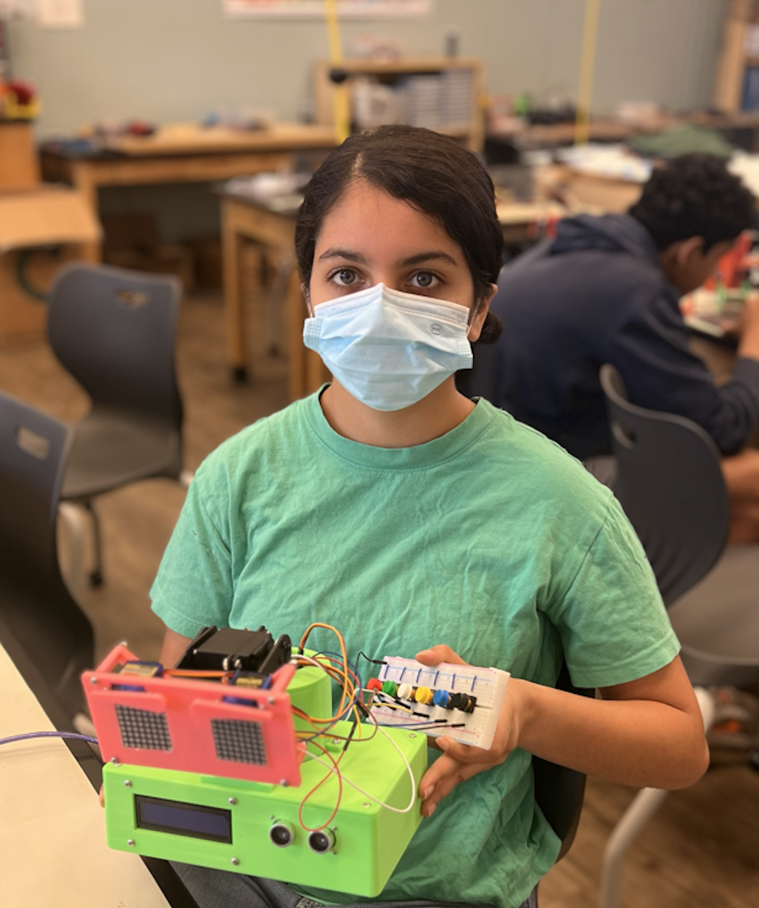
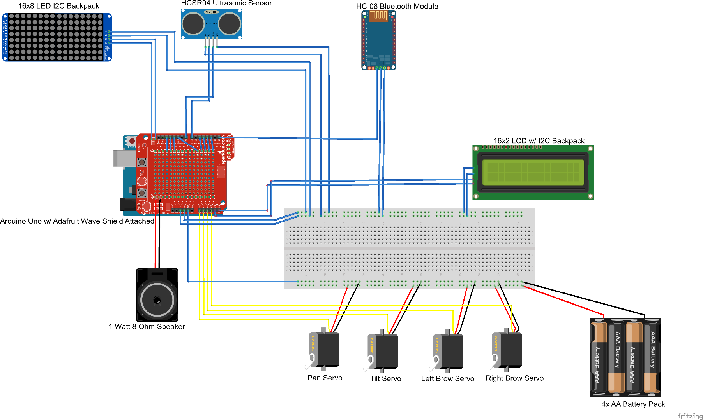

# WALL-E Emotive Robot
The WALL-E Emotive Robot detects how far it is from another object and displays an "emotion" that corresponds with that distance. It has and ultrasonic sensor which transmits and receives a signal to determine how far the nearest object is. Using that distance, an emotion is selected, for example, if the sensor detects an object that is within 10 centimeters of the robot, it will display anger. There are four main aspects of expressing an emotion: the LED matrices (the eyes), the LCD which says what emotion is being expressed, the two servos for the neck, and the two micro servos that are the robot's eyebrows. Each component is programmed to perform a specific action based on the distance calculated by the ultrasonic sensor. 

<!---->

  
<a href="https://www.instructables.com/Emotionally-Responsive-Robot/"> Project Guide </a>

# Demo Night

<iframe width="560" height="315" src="https://www.youtube.com/embed/vI2EpVrUjYY?si=85Vdq4SeV6kzq7Ps" title="YouTube video player" frameborder="0" allow="accelerometer; autoplay; clipboard-write; encrypted-media; gyroscope; picture-in-picture; web-share" referrerpolicy="strict-origin-when-cross-origin" allowfullscreen></iframe>

# Modification
<iframe width="560" height="315" src="https://www.youtube.com/embed/2XDlgbebQs0" title="YouTube video player" frameborder="0" allow="accelerometer; autoplay; clipboard-write; encrypted-media; gyroscope; picture-in-picture; web-share" allowfullscreen></iframe>

My modification was adding buttons to my robot in order to control it manually. I add six buttons of different colors to a breadboard. Each button corresponds to an emotion, and whenever the button is pressed, its corresponding emotion is displayed. I needed to use six pins on my Arduino in order to wire the buttons, so I used four of the analog pins and two of the digital pins to connect the buttons. In my code, I assigned a variable to the state of each button. Whenever the button was pressed, its state was low, so whenever the button state variable was low, it would call the functions to display an emotion.


# Final Milestone
<iframe width="560" height="315" src="https://www.youtube.com/embed/QYzmalx_MOU" title="YouTube video player" frameborder="0" allow="accelerometer; autoplay; clipboard-write; encrypted-media; gyroscope; picture-in-picture; web-share" allowfullscreen></iframe>

My final milestone was to finish the programming of the robot. At first, I was trying to upload the code provided in the guide, but I was getting many errors with it and it was not completely compatible with my project because my parts and wiring were slightly different. Due to this, I decided to write my own program rather than trying to alter the given code. 

There were two main parts that I still had to program: the LED matrices, and the servos. I was able to get the LED matrices to work as desired by replacing them again and wiring two single matrices together. I also used a different library than before, called LedControlMS, to program them so that I could display different patterns on each matrix, but only use three pins to connect them to the Arduino. The servos took slightly longer to program. Initially, when I wired the servos and uploaded code, the servos would not respond at all. I then changed the pins the servos were connected to from analog to digital pins, and I was then able to upload code. The servos required an external source of power since the arduino was not powerful enough to power them, so I also connected 4 AA batteries which provided 6 volts for the servos to use.

I did not expect that the programming process would take so long, especially because I did not think I would need to write my own program. Writing my own program gave me more control over the function of my robot, and I was able to gain a deeper understanding of how each component functions.

# Second Milestone

<iframe width="560" height="315" src="https://www.youtube.com/embed/RuqsUkzLOlw" title="YouTube video player" frameborder="0" allow="accelerometer; autoplay; clipboard-write; encrypted-media; gyroscope; picture-in-picture; web-share" allowfullscreen></iframe>

My second milestone was to finish assembling the "body" of the robot. I had to get all the parts 3D printed so that they could fit all the components, like the sensor and the LCD. The box at the bottom is what holds the circuit, and it was not ready for the longest time. The original plan was to use a plastic box and dremel out the the spaces I needed to support the components. However, the plastic was quite flimsy and thin, so when I tried using the dremel to cut it, the plastic slightly melted. Since I would have had to cut out many large pieces, it was best to 3D print the box instead. After switching to the 3D printed box, I realized that it was not big enough to store the entire circuit, so I switched to a smaller breadboard. I then screwed in the LCD and ultrasonic sensor into the box and the two micro servos into the face.

I changed my LED matrices from the previous set of four to two single matrices that I wired together. However, when I made this change, I was unable to upload code to them because they were both cut out of the set of four, which damaged their individual connections. I was able to program the LCD and ultrasonic sensor to work together to display the distance detected by the sensor onto the LCD. I can now focus on my final milestone, which is to program all the components of the robot, like the LED matrices and servos, to work together. 

# First Milestone

<iframe width="560" height="315" src="https://www.youtube.com/embed/AAFQRoqYj6Q" title="YouTube video player" frameborder="0" allow="accelerometer; autoplay; clipboard-write; encrypted-media; gyroscope; picture-in-picture; web-share" allowfullscreen></iframe>

My first milestone was to finish wiring all my components together and to be able to program the LED matrix so that a design of my choice shows up on it. In order to start wiring, I first had to solder resistors, capacitors, integrated circuits, and pin headers to the wave shield, which I placed onto the arduino. Since I have so many components that I need to connect to the Arduino, I used a breadboard facilitate these connections. I also put together the pan-tilt servos and their mounts and attached them to the 3D printed "neck" piece. My biggest challenge in finishing the wiring was connecting and programming the LED matrices. My matrices were different than the ones listed in the guide, so I had to use different pins to connect them to the Arduino. I also had to use a different Arduino library called LedControl to program the LED matrices to display a pattern. My first set of matrices did not respond to any uploaded code, so I had to replace them with a new set, which successfuly responded to code and displayed a programmed pattern. I now want to work towards my second milestone, which is assembling my 3D printed pieces to form the "body" of the robot.

# Starter Project

<iframe width="560" height="315" src="https://www.youtube.com/embed/yNEFJC3x2WI" title="YouTube video player" frameborder="0" allow="accelerometer; autoplay; clipboard-write; encrypted-media; gyroscope; picture-in-picture; web-share" allowfullscreen></iframe>

My starter project was the Exploding Star Color Organ, which responds to sound by lighting up various LEDs. This was not my original starter project, but I had to change it because of some soldering mistakes that melted one of the components. Soldering this project went quite smoothly, and I enjoyed learning about the the various components involved in the circuit and their functions.

<a href="https://www.instructables.com/Exploding-Star-Color-Organ/"> Starter Project Guide </a>

<!--**Don't forget to replace the text below with the embedding for your milestone video. Go to Youtube, click Share -> Embed, and copy and paste the code to replace what's below.**-->

# Schematics



In my project, I connected my LED matrix backpack to pins 13 (DIN), 12 (CS), and 11 (CLK). The signal wires of the servos are not connected to the analog pins, instead, they are connected to pins 3, 4, 5, and 6. I also used a smaller breadboard in order to condense my circuit to fit it inside the box.
<!--Here's where you'll put images of your schematics. [Tinkercad](https://www.tinkercad.com/blog/official-guide-to-tinkercad-circuits) and [Fritzing](https://fritzing.org/learning/) are both great resoruces to create professional schematic diagrams, though BSE recommends Tinkercad becuase it can be done easily and for free in the browser.--> 

# Code

```c++
#include <LiquidCrystal_I2C.h>
#include <LedControlMS.h>
#include <Servo.h>

// pins for LED matrix
int DIN = 13;
int CS = 12;
int CLK = 11;
// number of devices being programmed
#define NUM_DEVICE 2
// pins for all the buttons
#define BLACK_PIN 9
#define BLUE_PIN 2
#define YELLOW_PIN A3
#define WHITE_PIN A2
#define GREEN_PIN A1
#define RED_PIN A0
// pins for ultrasonic sensor
const int triggerPin = 7;
const int echoPin = 8;
// used to get distance from another object
float pulse_width, distance;
// instance of LCD
LiquidCrystal_I2C lcd = LiquidCrystal_I2C(0x27, 16, 2);
// instance if LED matrix
LedControl ledmatrix = LedControl(DIN, CLK, CS, NUM_DEVICE);
// instances of servos used to convery robot's emotion
Servo pan;  
Servo tilt;
Servo leftBrow;
Servo rightBrow;
// byte arrays with LED matrix patterns for each emotion
byte happyL_bmp[8] =
{ B00000000,
B00011100,
B00100100,
B01011100,
B01011100,
B00100100,
B00011100,
B00000000 };
byte happyR_bmp[8] =
{ B00000000,
B00011100,
B00100100,
B01011100,
B01011100,
B00100100,
B00011100,
B00000000 };
byte neutralL_bmp[8] =
{ B00000000,
B00111100,
B01000010,
B01011010,
B01011010,
B01000010,
B00111100,
B00000000 };
byte neutralR_bmp[8] =
{ B00000000,
B00111100,
B01000010,
B01011010,
B01011010,
B01000010,
B00111100,
B00000000 };
byte angryL_bmp[8] =
{ B00000000,
B00001100,
B00010010,
B00111010,
B01011010,
B11000010,
B00111100,
B00000000 };
byte angryR_bmp[8] =
{ B00000000,
B00111100,
B11000010,
B01011010,
B00111010,
B00010010,
B00001100,
B00000000 };
byte surprisedL_bmp[8] =
{ B01111110,
B10000001,
B10000001,
B10011001,
B10011001,
B10000001,
B10000001,
B01111110 };
byte surprisedR_bmp[8] =
{ B01111110,
B10000001,
B10000001,
B10011001,
B10011001,
B10000001,
B10000001,
B01111110 };
byte sadL_bmp[8] =
{ B00000000,
B00111100,
B01000010,
B01011010,
B00111010,
B00010010,
B00001100,
B00000000 };
byte sadR_bmp[8] =
{ B00000000,
B00001100,
B00010010,
B00111010,
B01011010,
B01000010,
B00111100,
B00000000 };
byte loveL_bmp[8] =
{ B01111000,
B10000100,
B10000010,
B01011001,
B01011001,
B10000010,
B10000100,
B01111000 };
byte loveR_bmp[8] =
{ B01111000,
B10000100,
B10000010,
B01011001,
B01011001,
B10000010,
B10000100,
B01111000 };

void setup() {
  // put your setup code here, to run once:
  Serial.begin(9600);
  // set up LCD
  lcd.init();
  lcd.backlight();
  // set up LED
  for (int i=0; i< NUM_DEVICE; i++){
    ledmatrix.shutdown(i,false);
  // Set the brightness to a low value 
    ledmatrix.setIntensity(i,1);
  // and clear the display */
    ledmatrix.clearDisplay(i);
  }

  pan.attach(6); 
  tilt.attach(5);
  leftBrow.attach(4);
  rightBrow.attach(3);

  lcd.println("Hello!          ");
  lcd.println("I am Brobot    ");
  delay(1000);
  lcd.setCursor(0, 0);
  lcd.clear();

  pinMode(YELLOW_PIN, INPUT_PULLUP);
  pinMode(BLUE_PIN, INPUT_PULLUP);
  pinMode(BLACK_PIN, INPUT_PULLUP); 
  pinMode(RED_PIN, INPUT_PULLUP); 
  pinMode(GREEN_PIN, INPUT_PULLUP);
  pinMode(WHITE_PIN, INPUT_PULLUP);
  // set up ultrasonic sensor
  pinMode(triggerPin, OUTPUT);
  pinMode(echoPin, INPUT);
  digitalWrite(triggerPin, LOW);
  delayMicroseconds(2);

}

void loop() {
  // put your main code here, to run repeatedly:
  // set up ultrasonic sensor signals
  digitalWrite(triggerPin, HIGH);
  delayMicroseconds(10);
  digitalWrite(triggerPin, LOW);
  // get and calculate distance
  pulse_width = pulseIn(echoPin, HIGH);
  distance = (pulse_width*0.0343)/2;
  int blackState = digitalRead(BLACK_PIN);
  int blueState = digitalRead(BLUE_PIN);
  Serial.println(blueState);
  int yellowState = digitalRead(YELLOW_PIN);
  int whiteState = digitalRead(WHITE_PIN);
  int greenState = digitalRead(GREEN_PIN);
  int redState = digitalRead(RED_PIN);
  // if-else statements determining emotion
  // each distance corresponds to an emotion and updateFace() and moveServos() are called to
  // express that emotion on the robot
   if(redState == LOW)
  {
    updateFace("ANGRY", angryL_bmp, angryR_bmp);
    moveServos(45, 135, 150, 100);
  }
  else if(greenState == LOW)
  {
    updateFace("SURPRISED       ", surprisedL_bmp, surprisedR_bmp);
    moveServos(100, 80, 170, 45);
  }
  else if(whiteState == LOW)
  {
    updateFace("LOVE            ", loveL_bmp, loveR_bmp);
    moveServos(115, 65, 170, 30);
  }
  else if(yellowState == LOW)
  {
    updateFace("HAPPY           ", happyL_bmp, happyR_bmp);
    moveServos(120, 60, 180, 60);
  }
  else if(blueState == LOW)
  {
    Serial.println("blue pressed");
    updateFace("SAD             ", sadL_bmp, sadR_bmp);
    moveServos(30, 150, 135, 120);
  }
  else if (blackState == LOW)
  {
    updateFace("NEUTRAL         ", neutralL_bmp, neutralR_bmp);
    moveServos(90, 90, 180, 90);
  }
  else
  {
      if(distance <= 10.0)
    {
      updateFace("ANGRY", angryL_bmp, angryR_bmp);
      moveServos(45, 135, 150, 100);
    }
    else if(distance <= 20.0)
    {
      updateFace("SURPRISED       ", surprisedL_bmp, surprisedR_bmp);
      moveServos(100, 80, 170, 45);
    }
    else if(distance <= 30.0)
    {
      updateFace("LOVE            ", loveL_bmp, loveR_bmp);
      moveServos(115, 65, 170, 30);
    }
    else if(distance <= 40.0)
    {
      updateFace("HAPPY           ", happyL_bmp, happyR_bmp);
      moveServos(120, 60, 180, 60);
    }
    else if(distance <= 50.0)
    {
      updateFace("SAD             ", sadL_bmp, sadR_bmp);
      moveServos(30, 150, 135, 120);
    }
    else
    {
      updateFace("NEUTRAL         ", neutralL_bmp, neutralR_bmp);
      moveServos(90, 90, 180, 90);
    }
  }
}

// takes in the emotion and the arrays for the eyes as parameters and uses them to change
// the LED matrices and LCD
void updateFace(String emotion, byte leftEye[], byte rightEye[])
{
  int i = 0;
  // draws pattern on left eye matrix
	for(i = 0; i < 8; i++)
	{
		ledmatrix.setColumn(0, i, leftEye[i]);
	}
	int j = 0;
  // draws pattern on right eye matrix
	for(j = 0; j < 8; j++)
	{
		ledmatrix.setColumn(1, j, rightEye[j]);
	}
  // displays emotion on LCD and resets cursor
  lcd.clear();
	lcd.print(emotion);
  lcd.setCursor(0, 0);
}

// takes in the angle measures that each servo turns as parameters and sets each servo to that angle
void moveServos(int left, int right, int panIn, int tiltIn)
{ 
  leftBrow.write(left);
  rightBrow.write(right);
  pan.write(panIn);
  tilt.write(tiltIn);

}
```

# Bill of Materials
<!--Here's where you'll list the parts in your project. To add more rows, just copy and paste the example rows below.
Don't forget to place the link of where to buy each component inside the quotation marks in the corresponding row after href =. Follow the guide [here]([url](https://www.markdownguide.org/extended-syntax/)) to learn how to customize this to your project needs. -->

| **Part** | **Note** | **Price** | **Link** |
|:--:|:--:|:--:|
| Arduino UNO REV3 | Facilitates the project's function | $28.50 | <a href="https://www.amazon.com/Arduino-A000066-ARDUINO-UNO-R3/dp/B008GRTSV6/"> Link </a> |
|  Adafruit Wave Shield for Arduino | Simplifies the interface of the Arduino. | $22.00| <a href="https://www.adafruit.com/product/94"> Link </a> |
| 8x8 LED Matrix + Backpack | Acts as the robot's "eyes" and displays its "emotion" | $7.99 | <a href="https://www.amazon.com/Alinan-MAX7219-Matrix-Display-Control/dp/B09TSJL783/ref=asc_df_B09TSJL783/?tag=hyprod-20&linkCode=df0&hvadid=599693037728&hvpos=&hvnetw=g&hvrand=8238989648180540621&hvpone=&hvptwo=&hvqmt=&hvdev=c&hvdvcmdl=&hvlocint=&hvlocphy=9032183&hvtargid=pla-1923353677832&psc=1/"> Link </a> |
| 16x2 LCD Character Display w/ I2C backpack | Displays the robot's greeting and emotions | $9.99 | <a href="https://www.amazon.com/Arduino-A000066-ARDUINO-UNO-R3/dp/B008GRTSV6/"> Link </a> |
| 2 Servo Motors | Pan-tilt servos that act as the robot's neck and head| $14.99 | <a href="https://www.amazon.com/180%C2%B0Metal-Waterproof-Airplane-Helicopter-Mechanical/dp/B09JWK2GB3/ref=asc_df_B09JWK2GB3/?tag=hyprod-20&linkCode=df0&hvadid=598270536205&hvpos=&hvnetw=g&hvrand=11300398354597975709&hvpone=&hvptwo=&hvqmt=&hvdev=c&hvdvcmdl=&hvlocint=&hvlocphy=9032183&hvtargid=pla-1675722646259&th=1"> Link </a> |
| Servo Mounts | Holds the face brackets that are controlled by the pan-tilt servos | $12.99 | <a href="https://www.amazon.com/Servo-Mount-Bracket-MG996R-Steering/dp/B07PQ12TXS/ref=asc_df_B07PQ12TXS/?tag=hyprod-20&linkCode=df0&hvadid=343191214486&hvpos=&hvnetw=g&hvrand=6717711391194757807&hvpone=&hvptwo=&hvqmt=&hvdev=c&hvdvcmdl=&hvlocint=&hvlocphy=9032183&hvtargid=pla-737353487171&psc=1&tag=&ref=&adgrpid=64450094290&hvpone=&hvptwo=&hvadid=343191214486&hvpos=&hvnetw=g&hvrand=6717711391194757807&hvqmt=&hvdev=c&hvdvcmdl=&hvlocint=&hvlocphy=9032183&hvtargid=pla-737353487171"> Link </a> |
| 2 Micro Servos | Controls the movement of the eyebrows | $7.29| <a href="https://www.amazon.com/Sipytoph-Helicopter-Airplane-Walking-Control/dp/B09185SC1W?th=1"> Link </a> |
| HC-SRO4 Ultrasonic sensor | Detects the robot's distance from another object | $4.50 | <a href="https://www.sparkfun.com/products/15569"> Link </a> |
| 4 AA Battery Holder | Powers the servos| $7.49 | <a href="https://www.amazon.com/LAMPVPATH-Battery-Holder-Switch-Leads/dp/B07L9M6VZK/ref=sr_1_1_sspa?keywords=4+aa+battery+holder&qid=1689792859&sr=8-1-spons&sp_csd=d2lkZ2V0TmFtZT1zcF9hdGY&psc=1"> Link </a> |
| Breadboard | Holds robot's buttons | $8.75| <a href="https://www.amazon.com/BB830-Solderless-Plug-BreadBoard-tie-Points/dp/B0040Z4QN8/ref=asc_df_B0040Z4QN8/?tag=hyprod-20&linkCode=df0&hvadid=312400581241&hvpos=&hvnetw=g&hvrand=16606392188512689734&hvpone=&hvptwo=&hvqmt=&hvdev=c&hvdvcmdl=&hvlocint=&hvlocphy=9032183&hvtargid=pla-420088669616&psc=1"> Link </a> |
| Half-Sized Breadboard | Facilitates connections of all the components | $5.99 | <a href="https://digilent.com/shop/half-size-breadboard/?setCurrencyId=1&sku=240-131&utm_source=google&utm_medium=cpc&utm_campaign=19554864174&utm_content=150882922291&utm_term=&gad=1&gclid=Cj0KCQjwk96lBhDHARIsAEKO4xaa3ED8sEutBLbjEh871sHWek4RCCiq7WpuP4eIGOnADPgulKTDijMaAs2cEALw_wcB"> Link </a> |
| Push Buttons with Caps| Used to control robot's emotions | $6.50 | <a href="https://www.digikey.com/en/products/detail/sparkfun-electronics/COM-10302/5775291?utm_adgroup=&utm_source=google&utm_medium=cpc&utm_campaign=PMax%20Product_Low%20ROAS%20Categories&utm_term=&utm_content=&gclid=Cj0KCQjwk96lBhDHARIsAEKO4xZRpqkOY9UzzxE58LD24HE5iyz0SD5z1RjrlX28txLZQxbrm1ZwCtoaAi2ZEALw_wcB"> Link </a> |
| Male to Male Jumper Wires| Connects components | $2.99 | <a href="https://www.gobilda.com/male-to-male-jumper-wire-multicolor-10cm-length-40-pack/?gclid=CjwKCAjwtuOlBhBREiwA7agf1lS-BS8JfcIFJY8AqaCmX-nIuHRRIh3_KrDNxksTdgUl74LAwvTaoBoCT2oQAvD_BwE"> Link </a> |
| Male to Female Jumper Wires| Connects components | $2.99 | <a href="https://www.gobilda.com/male-to-female-jumper-wire-multicolor-10cm-length-40-pack/?gclid=CjwKCAjwtuOlBhBREiwA7agf1ndxvQsFRX1XOCnEnoBYTUMTmP7cnIFctx1ge1UfRLZsSqIiLMeS2RoCV8EQAvD_BwE"> Link </a> |

