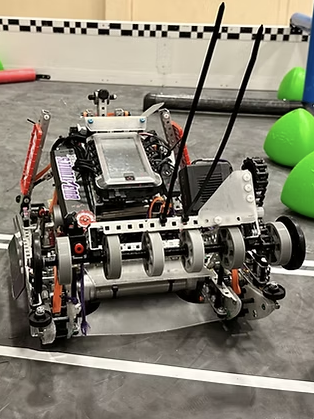

# [ASL Robotic Hand](./asl_robotic_arm.md)

# [Emotive Robot](./emotive_robot.md)

<!--[View Page](./emotive_robot.md)-->

# [EngineerED Website](https://eng-ed.org/)

EngineerED is a 501(c)(3) nonprofit organization, committed to broadening access to science and technology while fostering a love for STEM. We believe every child should have the opportunity to explore and engage with the wonders of these fields. Through our programs, we aim to ignite a passion for learning and discovery, empowering young minds to become the problem-solvers and innovators of the future.

# Patents
MACHINE LEARNING MODEL BASED EMISSIONS OPTIMIZATION CONTROLLER FOR HYBRID POWERED AIRCRAFTS (Patent-pending)

A ROBOTIC SIMULTANEOUS MULTI-MODAL COMMUNICATIONS ASSISTANT AND TRAINER FOR MEDICAL CLINICIANS (Patent-pending)

# Robotics (Team 12478X, Bobaionics)

Robots built in collaboration with my team for competitive robotics. Each machine features custom-designed mechanisms for tasks such as lifting, intaking, and precise control, powered by integrated motors, sensors, and programmed systems. Built for performance under competition rules, these robots balance durability, speed, and adaptability on the field.

# Speakers

Hand-assembled speakers built from quality components and enclosures. I focused on careful construction, wiring, and finishing to achieve reliable performance and a clean look. While based on established designs, the build process gave me hands-on experience with audio hardware and an appreciation for how craftsmanship impacts sound.

# ENGR 40M Labs
## Solar Charger

A solar-powered USB charger that stores and delivers renewable energy: this circuit uses a photovoltaic panel to charge a 3.7 V lithium-polymer battery and a DC–DC converter to boost the voltage to a steady 5 V output. The charger features a protected LiPo cell, regulated current flow, and insulated housing to prevent overheating or damage. Built through soldering and precise circuit layout, the project highlights efficient power conversion and practical energy storage design.

## Useless Box
<iframe src="https://drive.google.com/file/d/1nA2bQneGOgi17HOmr5WODcjLTr9x6Gkh/preview" width="240" height="320" allow="autoplay"></iframe>

A playful electromechanical device that turns itself off: when the switch on top of the box is flipped “on,” a small motor-driven arm emerges, presses the switch back to “off,” and retracts inside. Powered by three AA batteries and controlled through a circuit of DPDT and SPDT switches, the mechanism reverses motor polarity to extend and retract the arm. Housed in a laser-cut acrylic enclosure, the project introduced practical circuit assembly, motor control, and mechanical design integration.

## Useless Box with Modification
<iframe src="https://drive.google.com/file/d/19cOL0qUbFrW0iyGZsiXRePFPKNT3cxuv/preview" width="240" height="320" allow="autoplay"></iframe>

An Arduino-controlled electromechanical box that playfully reacts to user interaction: this upgraded version of the “useless box” uses an Arduino microcontroller and MOSFET-based motor driver circuit to automate motor control and create reactive behaviors. The system features a “shy” mode—delaying its response after three switch activations—and an “angry” mode—bobbing the arm before turning the switch off after five switch activations. Programmed as a finite state machine, the project highlights the integration of electronics, programming, and mechanical motion to produce dynamic, personality-driven responses.

## LED Board
<iframe src="https://drive.google.com/file/d/1bSJbQCQDPLo8lvQsY2VPWcOYsSzFqHnd/preview" width="240" height="320" allow="autoplay"></iframe>

A programmable LED array that displays dynamic patterns: this project uses high-intensity blue LEDs soldered onto a printed circuit board with an Arduino and driver circuitry. The LEDs are controlled using a pMOS transistor circuit and multiplexing, allowing each LED to be turned on only when its anode (horizontal wire) is high and its cathode (vertical wire) is low, while all other rows and columns are set to prevent unintended illumination. By planning the circuit layout, soldering the LEDs, and debugging connections, the project highlights hands-on experience in electronics assembly, current control, and creating visually engaging programmable displays.

## Music Board
<iframe src="https://drive.google.com/file/d/1fTkl2V-wFT-Ex_o3EDu1j0N0tywFn7zB/preview" width="320" height="240" allow="autoplay"></iframe>
A music-responsive LED display that visualizes sound in real time: the 4×4 LED board is divided into quadrants, each corresponding to a specific frequency range. When a particular range is detected from the audio input, the LEDs in that quadrant illuminate, creating a dynamic visual representation of the music. The project applies analog-to-digital conversion, frequency analysis, and Arduino programming to translate audio signals into engaging, real-time visual patterns.

# Other Projects
## PureCactus
Proposal Slides

  <iframe loading="lazy" style="position: absolute; width: 100%; height: 100%; top: 0; left: 0; border: none; padding: 0;margin: 0;"
    src="https://www.canva.com/design/DAG0bHJUonU/lswZ0qXqCw1GQnm_LVLukA/view?embed" allowfullscreen="allowfullscreen" allow="fullscreen">
  </iframe>

<a href="https:&#x2F;&#x2F;www.canva.com&#x2F;design&#x2F;DAG0bHJUonU&#x2F;lswZ0qXqCw1GQnm_LVLukA&#x2F;view?utm_content=DAG0bHJUonU&amp;utm_campaign=designshare&amp;utm_medium=embeds&amp;utm_source=link" target="_blank" rel="noopener">View Slides</a> 

A prototype water-purification tablet made using cactus mucilage, designed as a low-cost, accessible solution for removing impurities from water. The project focused on developing a natural, sustainable method for improving water quality, combining simple preparation with effective filtration.

## Rubberband-powered Plane

A lightweight flying model powered by elastic energy: this plane uses a rubber band-driven propeller, wing and tail structures, and a stub assembly to translate stored energy into flight. Built from simple materials, its design emphasizes balance, aerodynamic form, and structural stability so that the model flies reliably and smoothly.

## Automata

A hand-cranked mechanical automaton built from wood and 3D-printed components. Using a crank and cam system, it generates smooth, repeating motion in a compact frame.

